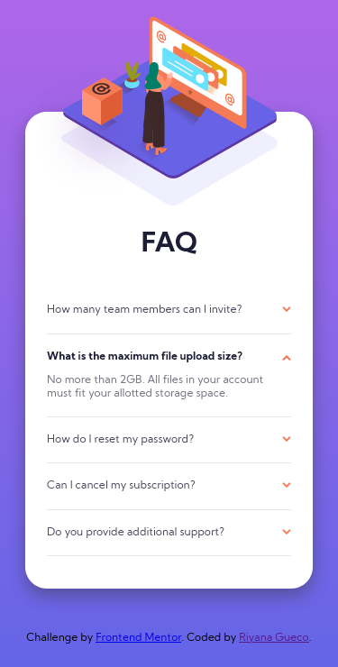

# Frontend Mentor - FAQ accordion card solution

This is a solution to the [FAQ accordion card challenge on Frontend Mentor](https://www.frontendmentor.io/challenges/faq-accordion-card-XlyjD0Oam). Frontend Mentor challenges help you improve your coding skills by building realistic projects. 

## Table of contents

- [Overview](#overview)
  - [The challenge](#the-challenge)
  - [Screenshot](#screenshot)
  - [Links](#links)
- [My process](#my-process)
  - [Built with](#built-with)
  - [Developer Notes](#developer-notes)
- [Author](#author)
- [Acknowledgments](#acknowledgments)

## Overview

### The challenge

Users should be able to:

- View the optimal layout for the component depending on their device's screen size
- See hover states for all interactive elements on the page
- Hide/Show the answer to a question when the question is clicked

### Screenshot

#### Desktop View

#### Mobile View

### Links

- Solution URL: [https://www.frontendmentor.io/solutions/faq-accordion-challenge-using-only-html-and-css-sHWBDMDJ6](https://www.frontendmentor.io/solutions/faq-accordion-challenge-using-only-html-and-css-sHWBDMDJ6)
- Live Site URL: [https://rngueco.github.io/faq-accordion-card/](https://rngueco.github.io/faq-accordion-card/)

## My process

### Built with

- Semantic HTML5 markup
- CSS custom properties
- Flexbox
- Mobile-first workflow

### Developer Notes

- Positioning images is hard, especially if it's positioned all fancy with layers on top of layers.
- I haven't had much experience working with SVGs prior to this project, but it was mostly the same as using JPEG and PNG images. Maybe in other projects or personal projects I might try my hand on making my own SVGs from scratch?
- This project required the use of JavaScript for expanding and collapsing the accordion, but a bonus challenge is to *not* use JS at all. I decided to take on that challenge. I think I did pretty well, except for the collapse transition.

## Author

- Frontend Mentor - [@rngueco](https://www.frontendmentor.io/profile/rngueco)
- GitHub - [@rngueco](https://github.com/rngueco)
- Twitter - [@RiyanaGueco](https://www.twitter.com/RiyanaGueco)

## Acknowledgments

Special thanks to Raymart and [Grace](https://www.frontendmentor.io/profile/grace-snow) for helping me make sense of all the confusing stuff happening to my layout due to positioning ✌.